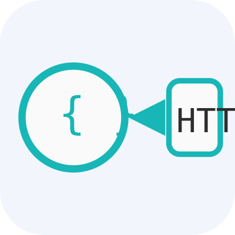

# OpenAPI/Swagger to HTTP File Converter 

## Overview

This VSCode extension allows you to **convert OpenAPI (Swagger v2) and OpenAPI v3 specification files** (`.yaml`, `.yml`, `.json`) into HTTP request collections (`.http` files). These `.http` files are compatible with VSCode's REST Client extension, enabling you to quickly test and explore API endpoints.

**Key Features:**
- Supports both Swagger v2 and OpenAPI v3.
- Parses request parameters, request bodies, and schemas—including nested `$ref` references.
- Automatically generates sample JSON request bodies for `POST`, `PUT`, and `PATCH` endpoints.
- Requests are separated by `###` for easy execution in REST Client.

## How It Works

1. **Open a Swagger/OpenAPI file** in VSCode (`.yaml`, `.yml`, `.json`).
2. **Run the command:**  
   `OpenAPI to HTTP: Transform`  
   (from Command Palette or right-click context menu)
3. The extension parses your spec file, resolves all schemas, and generates an `.http` file next to your spec.
4. Each API endpoint is converted into a REST Client request, separated by `###` for easy execution.
5. **Sample request bodies** are auto-generated using the schema definitions.

## Example Output

```http
###
# Create a new project
POST http://localhost/api/v2.0/projects
Content-Type: application/json

{
  "project_name": "",
  "public": false,
  "metadata": {},
  "cve_allowlist": {},
  "storage_limit": 0,
  "registry_id": 0
}

###
# Get project list
GET http://localhost/api/v2.0/projects
```

## Supported Features

- **Swagger v2:**  
  - Handles `definitions` for request/response schemas.
  - Detects `body` parameters and resolves `$ref`.
- **OpenAPI v3:**  
  - Handles `components.schemas`.
  - Detects `requestBody` and resolves nested `$ref`.
- **Modern icon:**  
  - Vibrant gradient background for a fresh look.

## File Filtering

To prevent the extension from processing non-OpenAPI files, it ignores specific filenames and keywords. This ensures it only targets actual specification files.

### Ignored Filenames
The following files are explicitly ignored:
- package.json
- tsconfig.json
- jsconfig.json
- settings.json
- launch.json
- tasks.json
- global.json
- appsettings.json
- config.json
- webpack.config.js
- webpack.config.json
- vite.config.js
- vite.config.json
- babel.config.js
- babel.config.json
- eslint.json
- eslint.yaml
- eslint.yml
- prettier.json
- prettier.yaml
- prettier.yml
- docker-compose.yml
- docker-compose.yaml

### Ignored Keywords
Files containing any of these keywords in their names are also ignored:
- config
- setting
- package
- tsconfig
- jsconfig
- appsettings
- docker-compose

This filtering helps avoid errors when running the command on configuration or unrelated files. Only `.yaml`, `.yml`, or `.json` files that appear to be OpenAPI specs will be processed.

## Usage Tips

- Make sure your API spec is valid YAML or JSON.
- The `.http` file is generated alongside your spec file.
- Use the [REST Client](https://marketplace.visualstudio.com/items?itemName=humao.rest-client) extension in VSCode to run requests directly.

## Contributing

1. Fork and clone this repo.
2. Run `npm install`.
3. Make your changes.
4. Run and debug using VSCode's Extension Development Host.
5. Submit a pull request!

## License

MIT

---

**Made with ❤️ for API developers and integrators.**